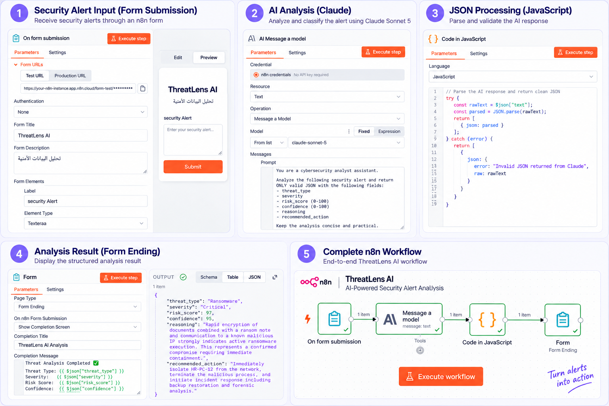

# ThreatLens-AI 🛡️

ThreatLens-AI is an AI-powered cybersecurity alert analysis workflow built with n8n. It analyzes security alerts, classifies the threat type and severity, calculates risk and confidence scores, and recommends appropriate response actions.

## 🔍 How It Works

1. A security alert is submitted through an n8n form.
2. The alert is analyzed and classified using Claude.
3. JavaScript processes and validates the AI response as structured JSON.
4. ThreatLens displays the final analysis and recommended response.

## 📊 Analysis Output

ThreatLens provides:

- Threat type
- Severity level
- Risk score (0–100)
- Confidence score
- Reasoning
- Recommended action

## 🛠️ Technologies Used

- n8n
- Claude
- JavaScript
- JSON

## 📁 Workflow

The exported n8n workflow is included in this repository:

`Threatlens-workflow.json`

## 🎯 Project Purpose

This project was created to explore how AI and workflow automation can support cybersecurity alert triage by turning raw security alerts into structured and actionable analysis.

## 🚀 Future Improvements

Future versions may include alert storage, dashboards, automated notifications, and integration with security monitoring tools.
